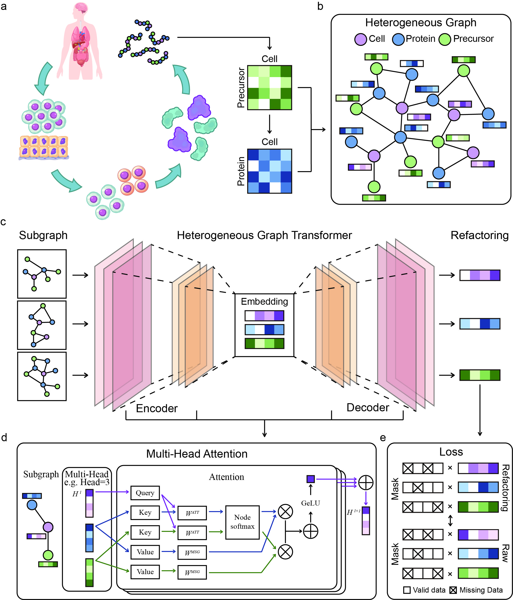

# scPPC

we developed scPPC, a reconstruction framework for single-cell proteomics data. scPPC builds a heterogeneous graph that captures the hierarchical relationships among cells, proteins, and peptides/precursors, and leverages a heterogeneous graph Transformer autoencoder to reconstruct protein expression profiles.

<p align="center">
  
</p>

## Development Environment

* CUDA Version: 12.0
* python: 3.8.18
* pytorch: 1.12.0

## Installation Environment

1. Create Environment

	```bash
	conda create -n scPPC python=3.8.18
	```

2. Activate Environment

	```bash
	conda activate scPPC
	```

3. Install dependencies

	Please select and download the PyTorch version that is compatible with your system configuration and supports CUDA. Take the Linux system we use as an example.
	torch = 1.12.0
	torch_cluster = 1.6.0
	torch_scatter = 2.1.0
	torch_sparse = 0.6.16

	```bash
	pip install https://download.pytorch.org/whl/cu113/torch-1.12.0%2Bcu113-cp38-cp38-linux_x86_64.whl
	pip install https://data.pyg.org/whl/torch-1.12.0%2Bcu113/torch_scatter-2.1.0%2Bpt112cu113-cp38-cp38-linux_x86_64.whl
	pip install https://data.pyg.org/whl/torch-1.12.0%2Bcu113/torch_sparse-0.6.16%2Bpt112cu113-cp38-cp38-linux_x86_64.whl
	pip install https://data.pyg.org/whl/torch-1.12.0%2Bcu113/torch_cluster-1.6.0%2Bpt112cu113-cp38-cp38-linux_x86_64.whl
	```

	Other dependent install.

	```bash
	pip install numpy=1.19.5
	pip install pandas=1.4.2
	pip install scipy=1.9.1
	pip install tqdm=4.64.0
	```

## Usage

Obtained the reconfiguration result.

```bash
python3 train.py --input_pro input/input_pro.csv --input_pep input/input_pep.csv --output output/
```

*input_pro  Path to protein input CSV.
*input_pep  Path to peptide input CSV.
*output  Output directory.
